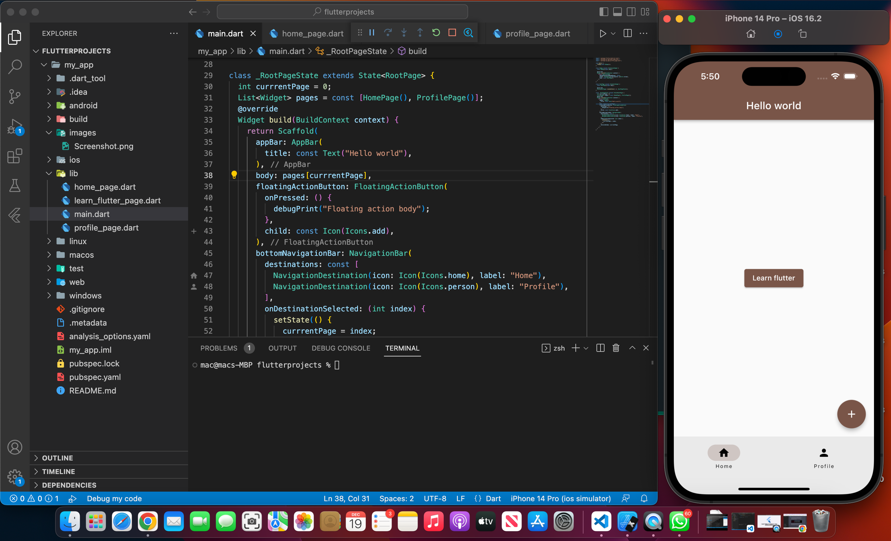
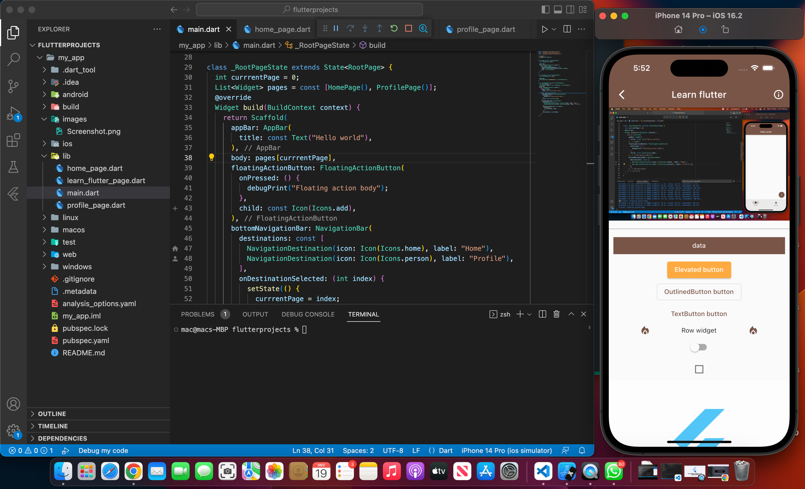

# Mini App

## Authors

- [@Honsmart](https://github.com/honsmart)

## Badges

Add badges from somewhere like: [shields.io](https://shields.io/)

## 🚀 About Me
I'm a full stack developer

## Tech Stack

Flutter, Dart

## Screenshots

